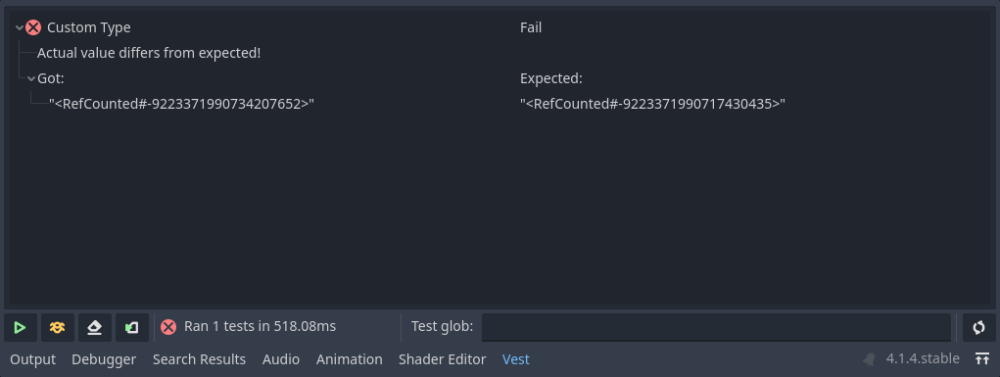

# Custom types

During testing, custom types may be involved - that is, values that are not one
of the [Godot built-in types]. These types can be best used with *vest* by
implementing specific methods.

## Assertions

`.equals(other)`
: When checking for equality, *vest* will use this method if implemented. Its
  only argument is the value it's being compared to. It should return `true` if
  the object equals the parameter.

: Used in: `expect_equal()`, `expect_not_equal()`,
  `assert_that().is_equal_to()`, `assert_that().is_not_equal_to()`

`.is_empty()`
: When checking for emptiness, *vest* will use this method if implemented. It
  should return true if the object is considered empty.

: Used in: `expect_empty()`, `expect_not_empty()`, `assert_that().is_empty()`,
  `assert_that().is_not_empty()`

`.has(item)`
: When checking if an object contains an item, *vest* will use this method if
  implemented. It should return `true` if the object contains the `item`.

: Used in: `expect_contains()`, `expect_does_not_contain()`,
  `assert_that().contains()`, `assert_that().does_not_contain()`


## Serialization

Running tests with custom types can result in reports such as below:



When running a test, *vest* spins up a separate Godot process to do so. Once
the tests have ran, the report is serialized to simple Godot types (
dictionaries, arrays, etc. ), and then sent over to the editor.

This also means that for custom types, *vest* uses a safe fallback for
serialization, in some cases resulting in reports that are difficult to read.

Implementing `_to_vest()` bridges this gap - *vest* will call this method to
serialize the object. Note that this method may return anything - including
other custom types. *Vest* will try and recursively serialize those.

Let's take a value-holder class for example:

```gdscript
class CustomData:
	var _value: Variant

	func _init(p_value: Variant):
		_value = p_value

	func equals(other):
    if other == null:
      return false
		if not (other is CustomData):
			return false
		return other._value == _value

	func _to_vest():
		return { "value": _value }
```

And use it in a test:

=== "define()"
    ```gdscript
    extends VestTest

    func get_suite_name():
      return "Custom data types"

    func suite():
      test("Custom type", func():
        var a := CustomData.new(2)
        var b := CustomData.new("foo")

        # Test report will contain a proper representation, instead of RefData<#...>
        expect_equal(a, b)
      )
    ```
=== "methods"
    ```gdscript
    extends VestTest

    func get_suite_name():
      return "Custom data types"

    func test_custom_type():
      var a := CustomData.new(2)
      var b := CustomData.new("foo")

      # Test report will contain a proper representation, instead of RefData<#...>
      expect_equal(a, b)
    ```

Running the test will fail with a readable report.


[Godot built-in types]: https://docs.godotengine.org/en/stable/tutorials/scripting/gdscript/gdscript_basics.html#basic-built-in-types
