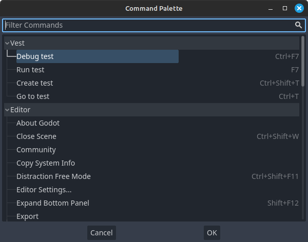

# Editor commands

*Vest* defines multiple editor commands that are added to Godot's *command
palette* and can also be accessed by keyboard shortcuts:

## Run test

Shortcut: ++f7++

Runs the currently open script as a *vest* test. If the script is not a test, a
warning is printed and nothing happens.

!!!note
    You'll need to select *Vest* on the bottom panel to see the test results,
    as addons can't change the focused panels by themselves.

## Debug test

Shortcut: ++ctrl+f7++

Runs the currently open script, in *debug mode*. This means that any
breakpoints or other debugger configurations you've set will be active.

If the script is not a test, a warning is printed and nothing will happen.

!!!note
    You'll need to select *Vest* on the bottom panel to see the test results,
    as addons can't change the focused panels by themselves.

## Create test

Shortcut: ++ctrl+shift+t++

Opens Godot's Create Script dialog pre-filled with the appropriate base class
and script path, based on the project settings. A convenient way to create a
test for the currently open script, in the right directory with the right file
name.

If the currently open script is already a test, nothing happens.

## Go to test

Shortcut: ++ctrl+t++

Quickly switch between the test and the script being tested. If multiple tests
are found for the currently open script, a pop-up menu opens with the
candidates. If no tests are found for the currently open script, an option to
create one is presented.

If the currently open script is a test, *vest* will try to find the script it
tests and open that.

