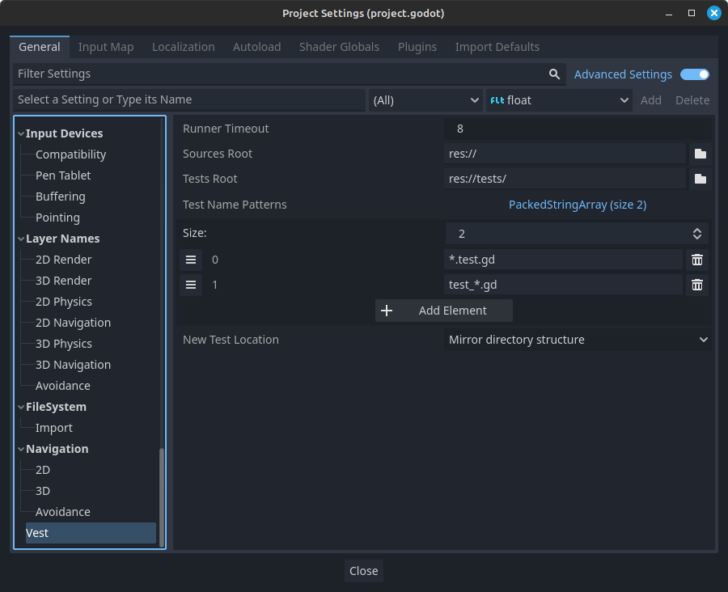

# Project Settings

*Vest* has some aspects that can be configured. These are stored in the
*project settings*:

!!!note
    All of *vest*'s settings are marked as advanced, meaning the *Advanced
    Settings* toggle must be on for them to show up.

## Runner Timeout

Defines the timeout for running tests, in seconds - if the test process takes
longer than this setting, it will be abandoned. Useful to avoid waiting
indefinitely for tests that fail to terminate.

## Sources Root

The root directory for non-test code. *Vest* will assume this is the directory
where all game-related scripts are stored, either directly or in
subdirectories.

Among others, this setting is used to figure out the source script when
jumping between test and implementation using [Editor commands].

## Tests Root

The root directory for test code. *Vest* consider this directory as the default
for new tests.

This setting is used for [Editor commands].

## Test Name Patterns

*Vest* will use these patterns to map test scripts to their original scripts.
The list is in order of preference - the first item is considered the default,
while the others are fallbacks.

For example, given a script called `patterns.gd`, this is how each pattern maps
the filename:

- `*.test.gd` ⇒ `patterns.test.gd`
- `test_*.gd` ⇒ `test_patterns.gd`

The mappings are bidirectional. Using the [Go to test command], when trying to
navigate from `patterns.gd`, *vest* will look for `patterns.test.gd` and
`test_patterns.gd`. And when trying to navigate from `test_patterns.gd`, *vest*
will assume that the test belongs to `patterns.gd` and try to navigate there.

## New Test Location

When using the [Create test command], *vest* will use this setting to determine
in which directory to suggest creating the test.

The examples below will assume the following settings:

- Sources root: `res://src/`
- Test root: `res://tests/`

Mirror directory structure
: The suggested path will mirror the same directory structure as under the
  *Sources Root*, relative to *Tests Root*:

: `res://src/feature/script.gd` ⇒
  `res://tests/feature/script.test.gd`

Next to source
: *Vest* will suggest to create the test right next to the source:

: `res://src/feature/script.gd` ⇒
  `res://src/feature/script.test.gd`

In tests root
: *Vest* will suggest to create the test under the test sources root:

: `res://src/feature/script.gd` ⇒
  `res://tests/script.test.gd`

: Note that this option will put all new tests *directly* under the tests root,
  without any subdirectories.

[Editor commands]: ./editor-commands.md
[Go to test command]: ./editor-commands.md#go-to-test
[Create test command]: ./editor-commands.md#create-test
