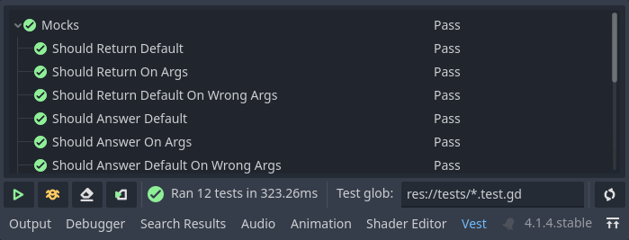

# Running from UI

*Vest*'s UI lives in the editor's bottom panel.

## Elements

While each element has its tooltip or description, here's an overview:

 Run tests
:   Run all test scripts matching the *Test glob*.

 Debug tests
:   Run all test scripts matching the *Test glob*, in debug mode.
    
    Useful when something doesn't behave as expected and needs debugging.

 Clear results
:   Clear the test report, emptying the panel.

 Run on save
:   Toggles *Run on save* - when enabled, tests are re-run each time a script
    is modified and saved.

    Useful for getting quick feedback while implementing tests.

 Refresh mixins
:   Vest's `VestTest` class is generated from multiple *mixin* classes. In case
    any of these change, use the *Refresh mixins* button to update the generated
    classes.

    Usually only necessary during addon development.

## Run vs. Debug

In order to be as unintrusive as possible, *vest* runs your tests in the
background, in headless mode. This means spawning a process *completely
independent* of the Godot editor, without connecting to the debugger.

Running tests independently means that the editor cannot debug the tests while
running, or receive any `print()`s.

If you want to debug your tests, use the 
*debug* button.
